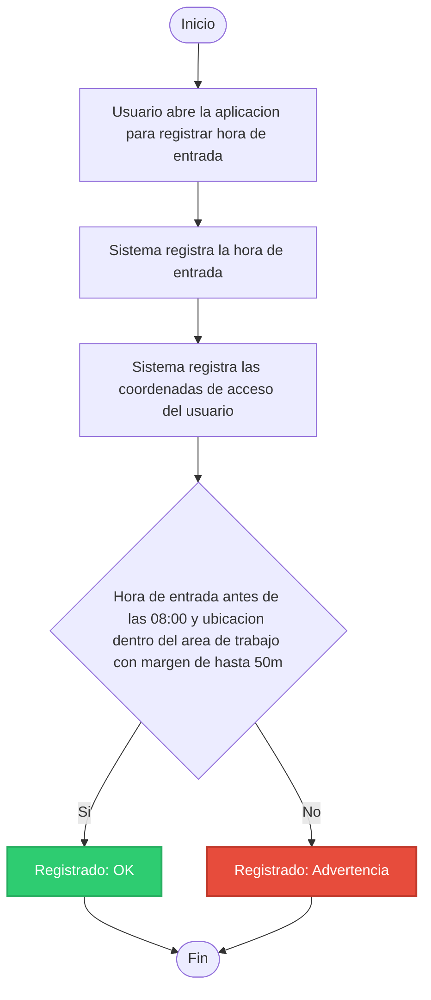

# Repositorio
Tareas de la U

```mermaid
flowchart TD
    A([Inicio]) --> B["Usuario abre la aplicacion para registrar hora de entrada"]
    B --> C["Sistema registra la hora de entrada"]
    C --> D["Sistema registra las coordenadas de acceso del usuario"]
    D --> E{"Hora de entrada antes de las 08:00 y ubicacion dentro del area de trabajo con margen de hasta 50m"}
    E -->|Si| F["Registrado: OK"]
    E -->|No| G["Registrado: Advertencia"]
    F --> H([Fin])
    G --> H

    classDef ok fill:#2ecc71,stroke:#27ae60,stroke-width:2px,color:#ffffff
    classDef warn fill:#e74c3c,stroke:#c0392b,stroke-width:2px,color:#ffffff

    class F ok
    class G warn
```